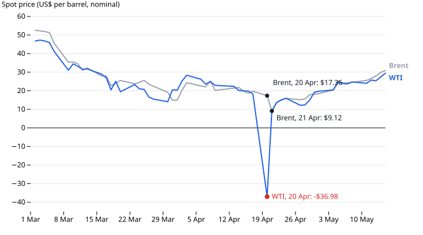

# DataPressr 🍇 ➛ 🍷

**AI agent skills for turning messy source data into reproducible datasets and clear data stories.**

Give your AI coding assistant a source file or URL, and DataPressr's skills have it archive the original, build tidy CSVs with a rerunnable script, document the schema, sources and licence, and check the result. Then add analysis, charts or a short data story. The output is ordinary files in your own folder or Git repository; publishing to [DataHub](https://datahub.io) is optional.

**Website and docs: [datapressr.datahub.io](https://datapressr.datahub.io)**

## Install

You need Node.js (for `npx`) and an AI coding assistant that supports skills. From the folder where you want your datasets:

```sh
npx skills add datasets/datapressr
```

Then start your assistant in that folder and ask, for example:

> Use DataPressr's archive and structure skills to turn this source into a dataset: [paste a URL or file path]. Then run the validate skill.

The [setup guide](https://datapressr.datahub.io/docs/cli) covers the installer's options and each skill. The skills themselves are readable playbooks in [`skills/`](skills/README.md).

## See what it makes

[](https://datapressr.datahub.io/stories/oil-prices)

This chart is generated from the [oil-prices dataset](datasets/energy-and-commodities/oil-prices) by a checked-in script, for the story [WTI Went Negative. Brent Didn't.](https://datapressr.datahub.io/stories/oil-prices) Browse all [datasets](https://datapressr.datahub.io/datasets) and [stories](https://datapressr.datahub.io/stories).

## Contributing and maintainers

Work is tracked in [Beads](https://github.com/steveyegge/beads) (`bd`); [`AGENTS.md`](AGENTS.md) holds the project conventions. Start a new agent session with "Read NEXT.md and follow it." The [session prompt](NEXT.md) selects work from `bd ready`; the [handoff protocol](docs/next-session-brief.md) provides execution details and the [migration audit](docs/next-audit.md) records completed work and the Beads plan. Planning and evidence live in [`docs/`](docs/README.md); the published site is built from [`site/`](site/).

## Built by

[Rufus Pollock](https://rufuspollock.com) and [Datopian](https://datopian.com), drawing on more than 20 years of data wrangling and open data experience.

The DataPressr skills, code and accompanying documentation are open source under the [MIT licence](LICENSE). Datasets and archived source material retain their own licences, recorded in each dataset’s metadata.
