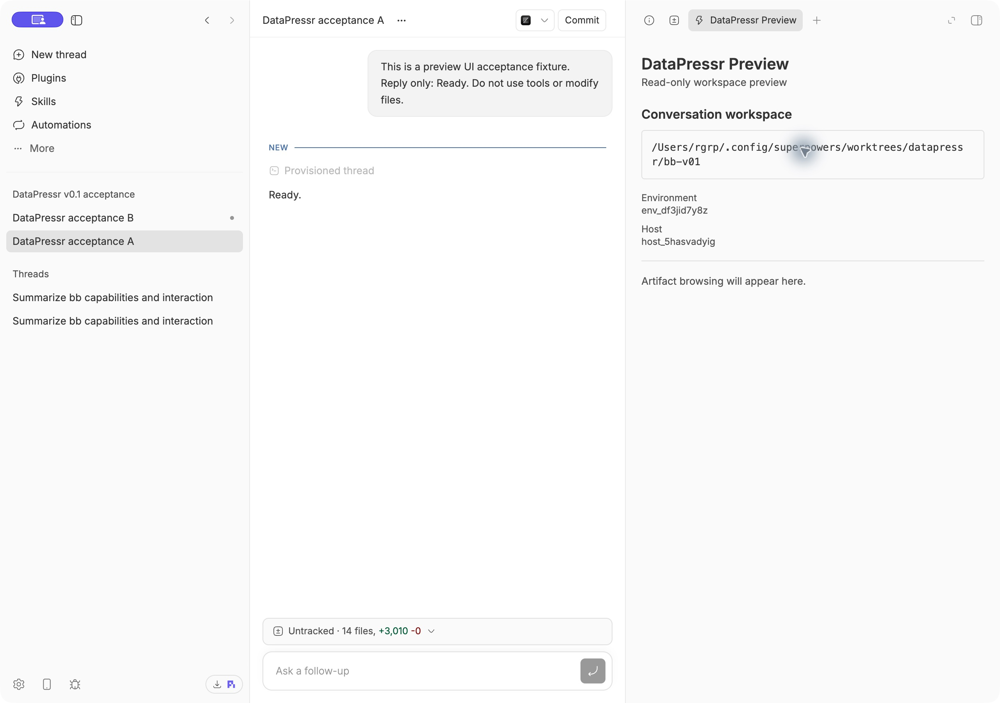
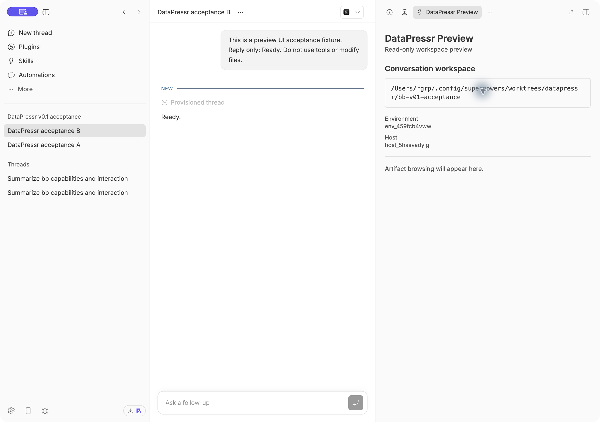

# BB preview v0.1 acceptance evidence

## Workspace adapter — 2026-09-30

Task: `datapressr-49p.1`. BB 0.44.0, SDK 0.5.29. This is Task 1 evidence, not a completed v0.1 release claim. The tested source is the commit introducing this report; its hash is recorded in Beads after committing.

Production installation: `/Users/rgrp/.config/superpowers/worktrees/datapressr/bb-v01/desktop-app`, branch `feat/bb-v01`. Existing PoC worktree `/Users/rgrp/.config/superpowers/worktrees/datapressr/bb-preview-spike` preserved. Same plugin ID, `datapressr-preview`, explicitly reinstalled from the new directory. The old fixture setting is unused by production code.

Verification: `npm ci --ignore-scripts` completed (zero audit vulnerabilities, upstream prebuild-install deprecation warning); `npm test` passed 9 tests after first failing against the unimplemented adapter; `npm run typecheck` and `npm run build` passed. Tests cover distinct canonical worktrees, absent environment, destroyed/provisioning/retiring environments, remote host with an existing local path, unknown primary host, unavailable BB service and deleted directory. SDK calls are typechecked against the installed public contract. There are no experimental API calls in this adapter.

Native BB was launched and operated through computer control. Created dedicated project `proj_echarqvzcz` and two Codex fixture threads with a prompt to reply “Ready” without tools or file changes. Both replied. Opened each thread's new-tab launcher and selected DataPressr Preview, then inspected the accessibility tree and rendered screenshots. The plugin showed the actual environment path in each case, including B's different worktree within the same project:

| Thread | Environment | Rendered workspace |
| --- | --- | --- |
| `thr_uma966m4g5` | `env_df3jid7y8z` | `/Users/rgrp/.config/superpowers/worktrees/datapressr/bb-v01` |
| `thr_tfza99iapt` | `env_459fcb4vww` | `/Users/rgrp/.config/superpowers/worktrees/datapressr/bb-v01-acceptance` |

The test threads are idle and the preview tabs remain available. No development watcher was running during these checks. Remote and absent environment states were tested at the adapter boundary; no remote machine was provisioned. Artifact viewing, refresh, skill execution and release installation acceptance remain open in subsequent Beads. The brief Codex replies do not count as skill integration acceptance.
