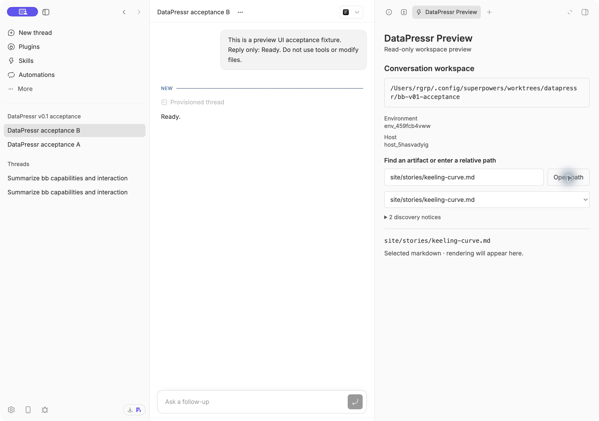
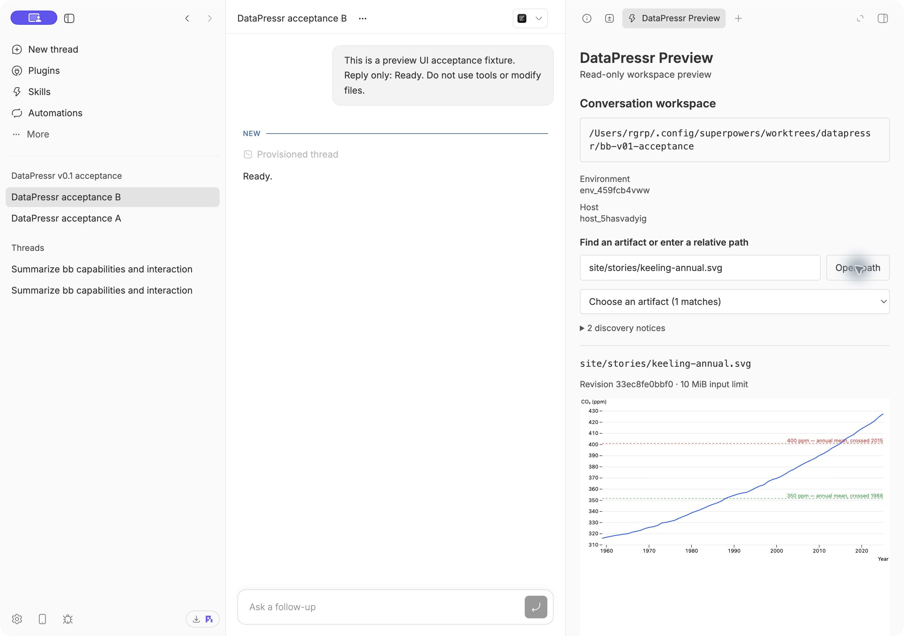
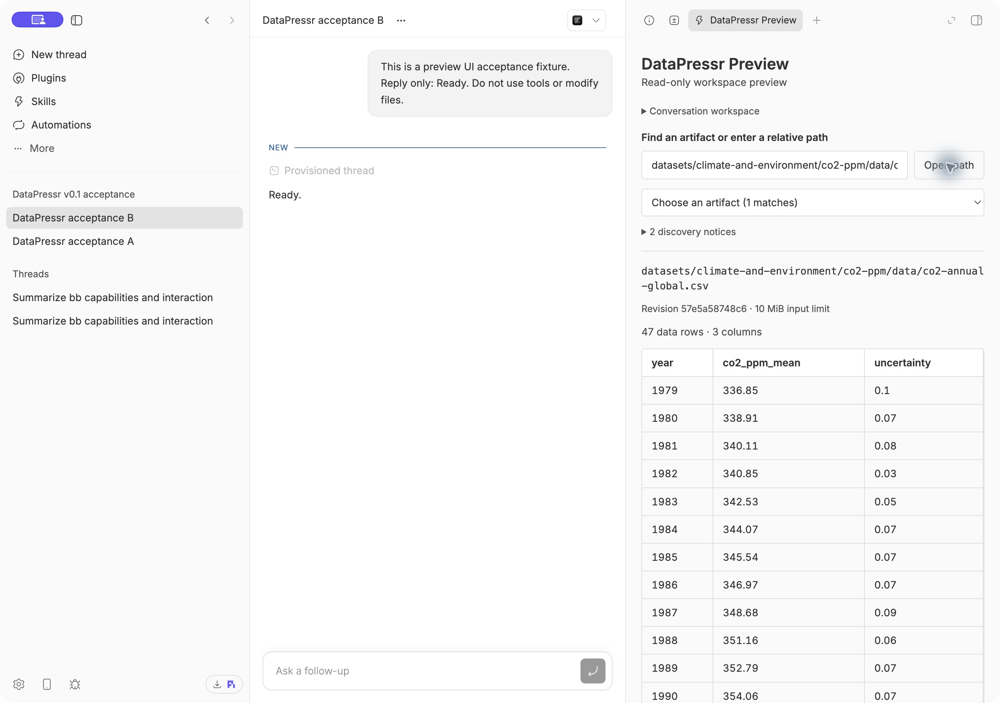
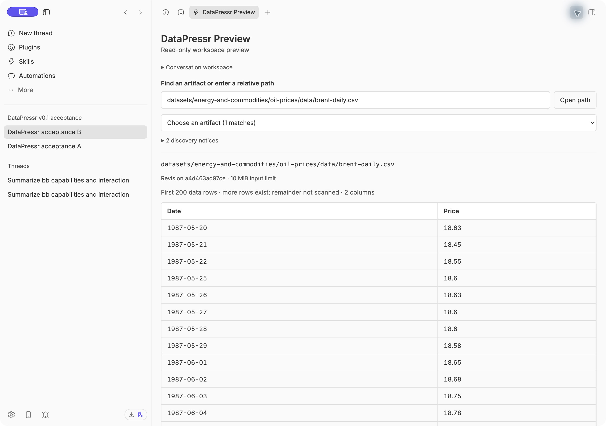

# BB preview v0.1 acceptance evidence

## Workspace adapter — 2026-09-30

Task: `datapressr-49p.1`. BB 0.44.0, SDK 0.5.29. This is Task 1 evidence, not a completed v0.1 release claim. The tested source is the commit introducing this report; its hash is recorded in Beads after committing.

Production installation: `/Users/rgrp/.config/superpowers/worktrees/datapressr/bb-v01/desktop-app`, branch `feat/bb-v01`. Existing PoC worktree `/Users/rgrp/.config/superpowers/worktrees/datapressr/bb-preview-spike` preserved. Same plugin ID, `datapressr-preview`, explicitly reinstalled from the new directory. The old fixture setting is unused by production code.

Verification: `npm ci --ignore-scripts` completed (zero audit vulnerabilities, upstream prebuild-install deprecation warning); `npm test` passed 9 tests after first failing against the unimplemented adapter; `npm run typecheck` and `npm run build` passed. Tests cover distinct canonical worktrees, absent environment, destroyed/provisioning/retiring environments, remote host with an existing local path, unknown primary host, unavailable BB service and deleted directory. SDK calls are typechecked against the installed public contract. There are no experimental API calls in this adapter.

Native BB was launched and operated through computer control. Created dedicated project `proj_echarqvzcz` and two Codex fixture threads with a prompt to reply “Ready” without tools or file changes. Both replied. Opened each thread's new-tab launcher and selected DataPressr Preview, then inspected the accessibility tree and rendered screenshots. The plugin showed the actual environment path in each case, including B's different worktree within the same project:

| Thread | Environment | Rendered workspace |
| --- | --- | --- |
| `thr_uma966m4g5` | `env_df3jid7y8z` | `/Users/rgrp/.config/superpowers/worktrees/datapressr/bb-v01` |
| `thr_tfza99iapt` | `env_459fcb4vww` | `/Users/rgrp/.config/superpowers/worktrees/datapressr/bb-v01-acceptance` |

The test threads are idle and the preview tabs remain available. No development watcher was running during these checks. Remote and absent environment states were tested at the adapter boundary; no remote machine was provisioned. Artifact viewing, refresh, skill execution and release installation acceptance remain open in subsequent Beads. The brief Codex replies do not count as skill integration acceptance.

## Artifact discovery and selection — 2026-09-30

Task `datapressr-49p.2`: five new tests passed (14 total), with typecheck and build passing. Native BB acceptance B discovered 465 artifacts. Searched `co2-ppm`, opened the grouped README and `data/co2-annual-global.csv`, then used direct relative-path entry for `site/stories/keeling-curve.md`. Exact selected paths and kinds were visible. Rendering is intentionally deferred to Tasks 4–5. Discovery reads no remote URLs, skips symlinks and excluded directories, bounds traversal at 10,000 entries and limits metadata reads to 1 MiB. Tests include the real repository paths and malformed metadata fixtures.

## Bounded file and asset transport — 2026-09-30

Task `datapressr-49p.3`: 19 tests pass, typecheck/build pass. Real-filesystem checks cover quoted/Unicode paths, valid parents, absolute/encoded traversal, file and directory symlink escape, missing/non-file/unsupported/oversized inputs, content hashes, CSS/SVG data URLs, and different contents in separate roots. Every RPC resolves the thread environment on the server; its strict input rejects a client-supplied root. Reads stop at 10 MiB even if a writer grows the file during reading.

Transport uses BB's existing authenticated RPC facility. No new HTTP endpoint, exposed token, or authentication override is introduced. The returned base64 asset URLs render inside `sandbox=""` frames with restrictive CSP and no scripts. In native BB, opened acceptance B's `site/stories/keeling-annual.svg` and visually confirmed the real chart, axis labels and threshold annotations. CSS delivery is covered by filesystem tests; document-relative HTML/CSS rendering is exercised by Task 5.

## CSV renderer — 2026-09-30

Task `datapressr-49p.4`: 24 tests pass, typecheck/build pass. Native checks showed the CO₂ annual global table (47 rows, three columns), Brent daily sample (first 200 rows, explicitly not a total), and both split and expanded panel layouts. A malformed CSV fixture showed a parser error; choosing valid CO₂ data restored the table without a reload. No rows from the previous selection remained. The live test initially caught a Node-only csv-parse import; switching to its official browser ESM build fixed plugin loading and was rechecked in the same UI.

