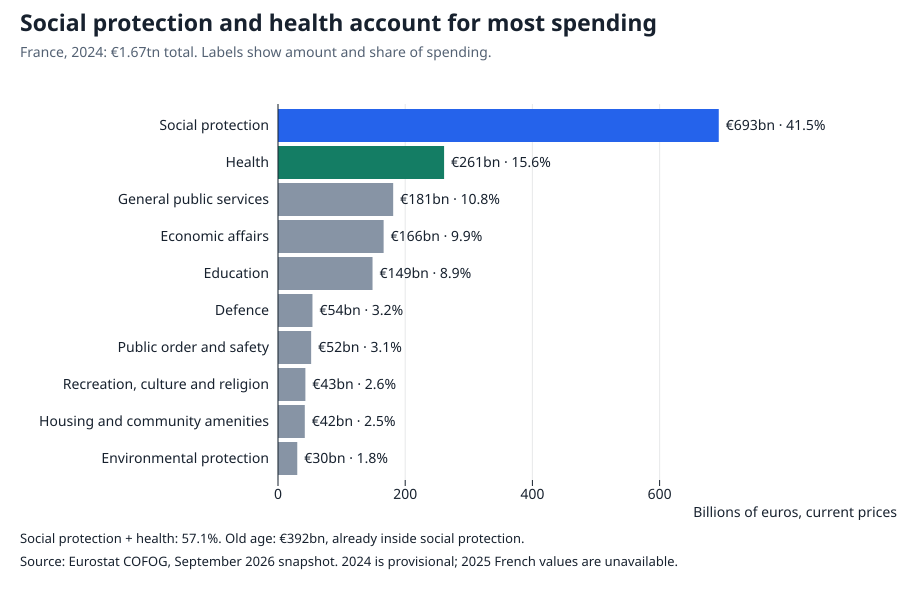
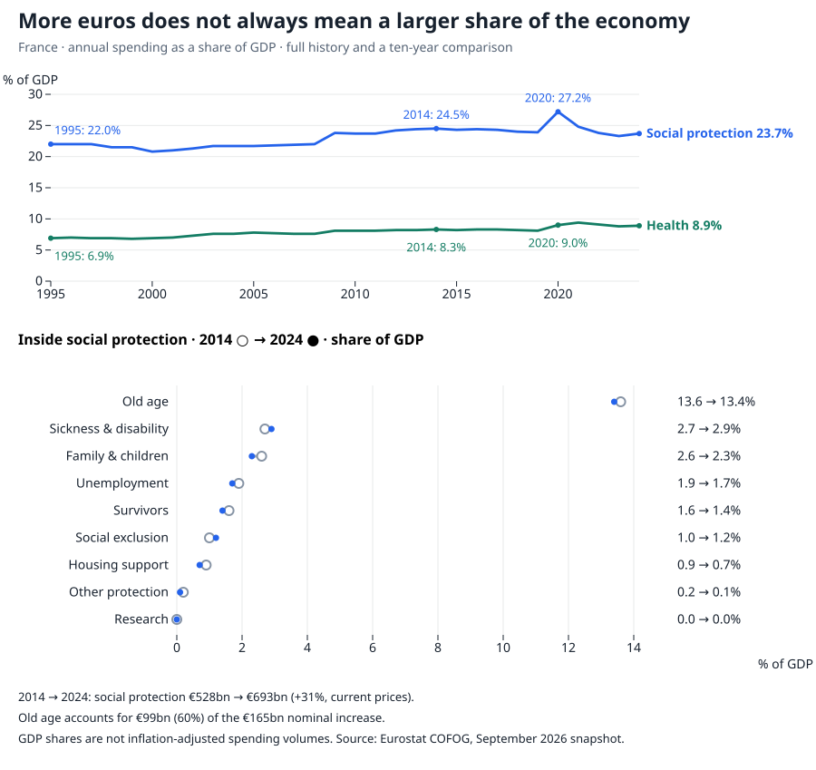
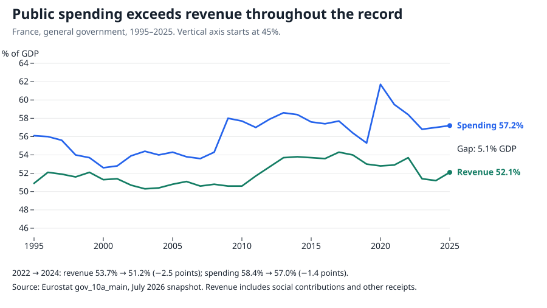
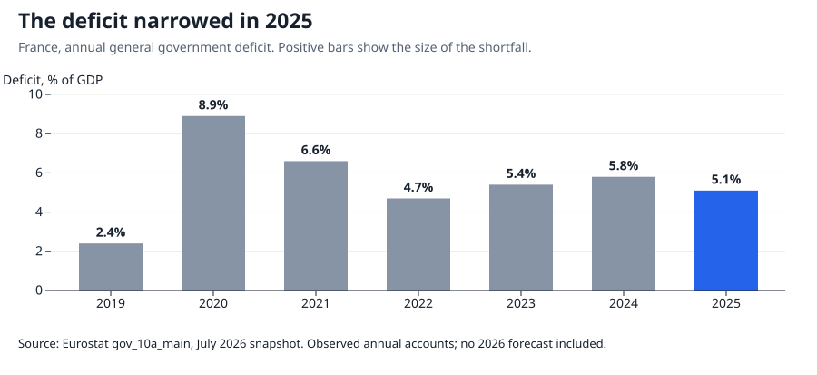
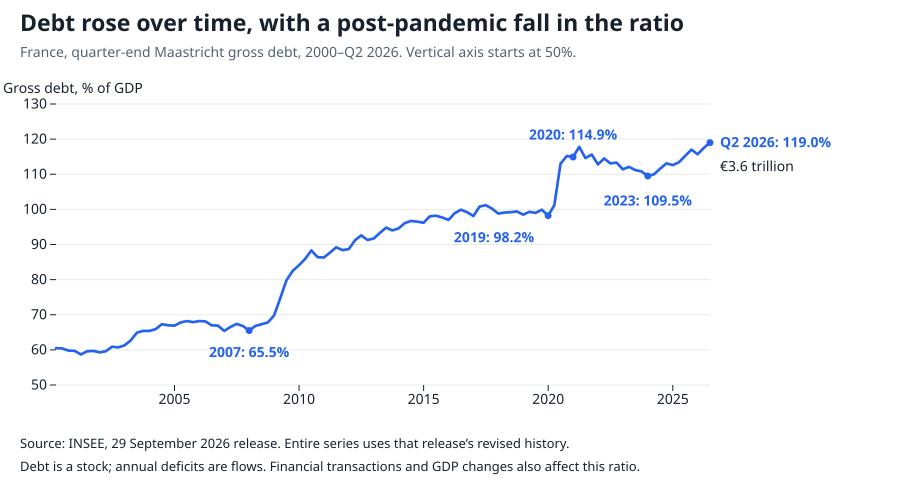

# Where France’s public money goes

France spent **€1.7 trillion** in 2025, about **€153 billion more than it raised**. Where did that money go—and which bills are growing?

These figures include central government, local government and social security. Receipts include taxes, social contributions and other income.

## The biggest commitment is social protection

Social protection and health together take **57.1% of public spending**. The latest detailed breakdown is for 2024, a year behind the headline accounts.

“Social protection” bundles together very different commitments.

**Old age alone accounts for €392 billion**: more than half of social protection, and almost a quarter of all public spending. Unemployment support is a much smaller component. Survivors’ benefits are counted separately; the old-age category should not be read as a total for every kind of pension.

Sickness and disability support is separate from healthcare. Housing support here is also distinct from housing and community amenities in the overall budget. These are spending purposes: salaries run across them, rather than forming an extra slice to add on top.

## Bigger bills, but not always a bigger share of the economy

Social protection cost **31% more euros** in 2024 than in 2014. Old age accounted for **60% of that nominal increase**. Yet nominal GDP grew faster than the total social-protection bill: its GDP share fell from **24.5% to 23.7%**.

That decade is not the whole history. Social protection took **22% of GDP in 1995**, so its share has risen over the longer period. Health has grown on both comparisons: from **6.9% in 1995** to **8.3% in 2014** and **8.9% in 2024**.

Neither euro growth nor a GDP ratio measures extra services delivered. Prices, benefit levels and the number of recipients all matter. For the recent increases, [INSEE points to inflation-linked pension uprating and rising healthcare prices and volumes](https://www.insee.fr/fr/statistiques/8735252). These accounts cannot separate the long-run effects of ageing from policy changes.

## The deficit also has a revenue side

The deficit widened between 2022 and 2024 even though spending fell relative to GDP. **Receipts fell further.** [INSEE attributes the 2023 weakness](https://www.insee.fr/fr/statistiques/8194620) to slower taxable bases, including corporate profits and property transactions, and tax reductions.

The mismatch predates those years: spending exceeded receipts throughout this 31-year record. Interest is not the whole explanation. The [IMF estimates that France’s 2025 deficit before interest was still 3% of GDP](https://www.imf.org/en/news/articles/2026/07/22/pr26255-france-imf-executive-board-concludes-2026-article-iv-consultation). Its cycle-adjusted assessment also finds a persistent gap.

There was an improvement in 2025: the deficit narrowed to **5.1% of GDP**, with [stronger receipts and slower spending growth](https://www.insee.fr/fr/statistiques/8997691). Large commitments help explain the budget’s scale; their size alone does not explain each change in the gap.

## Repeated gaps accumulate into debt

By June 2026, public debt stood at **€3.6 trillion**, or **119% of GDP**. Deficits add to that stock, though financial transactions also change debt and GDP growth changes the ratio. This history establishes a financing problem; it does not predict default or identify which programmes should be cut.

## How this was made

Three [CSV datasets and definitions](https://github.com/datasets/datapressr/tree/main/datasets/france-public-finances), an [offline data build](https://github.com/datasets/datapressr/blob/main/datasets/france-public-finances/build.ts) and a [chart script](https://github.com/datasets/datapressr/blob/main/site/stories/france-public-finances-make-charts.mjs) reproduce the figures from archived Eurostat and INSEE releases. Source precision is retained in the data; displayed amounts are rounded. Annual accounts, spending detail and quarterly debt use their own release dates and remain subject to revision.
