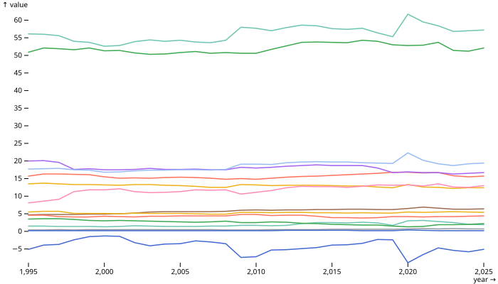
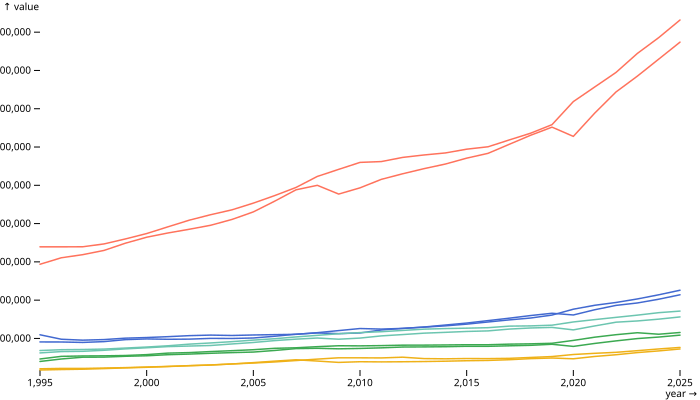
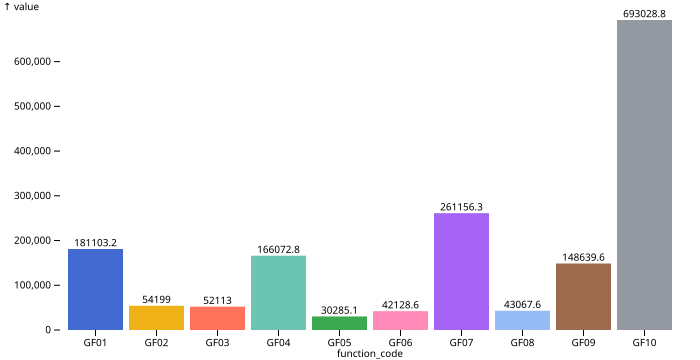
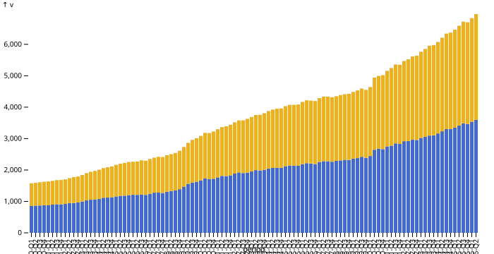
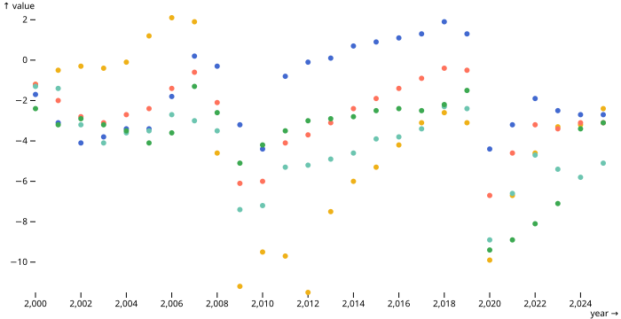

France's public finances are a big topic, and there is a lot of data about them. This story takes a tour of the French public finances dataset, which has three tables: fiscal accounts from Eurostat, general government spending by function (COFOG), and quarterly debt from INSEE. Together they cover several decades, with most annual series running to 2025 and the debt series running to the middle of 2026. Each table has a value column and a unit column.

## The indicators

The fiscal accounts table has fifteen indicators for France, from net lending (B9) to gross fixed capital formation (P51G), compensation of employees (D1PAY), interest (D41PAY) and social benefits (D62PAY). Here they all are as shares of GDP.

Total general government expenditure (TE) was 1,714,137.2 million euros in 2025 and total revenue (TR) was 1,561,626.1 million euros. Net lending was -152,511.1 million euros, or -5.1.

## Other countries

The dataset also has Germany, Italy, Spain and the EU27 aggregate. The chart below shows revenue and expenditure for each of them in million euros.

Germany's B9 was -2.7 in 2025, Italy's -3.1 and Spain's -2.4.

## Spending by function

Spending is divided into ten COFOG functions, GF01 to GF10. In 2024 GF10 was 693028.8, GF07 was 261156.3, GF01 was 181103.2, GF04 was 166072.8 and GF09 was 148639.6.

There are also second-level codes inside each function:

## Debt

The quarterly debt table has gross and net debt from 2000-Q1 to 2026-Q2. In 2026-Q2 gross debt was 3,595.5 billion euros and net debt was 3,366.8 billion euros, and gross debt was 119 percent of GDP.

## Deficits

Here are the deficits of all five series since 2000.

## Conclusion

Public finances are complex and there are many ways to look at them. Spending, revenue, debt and deficits all move over time, and France can be compared with other European countries. There is a lot more to explore in this dataset.
