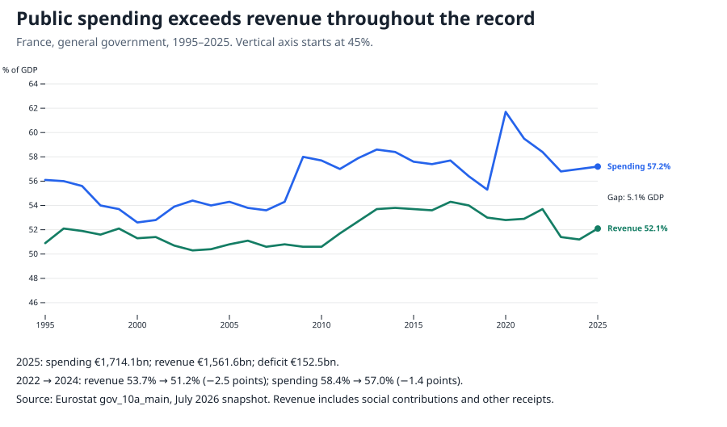
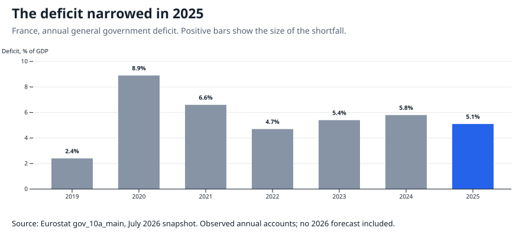
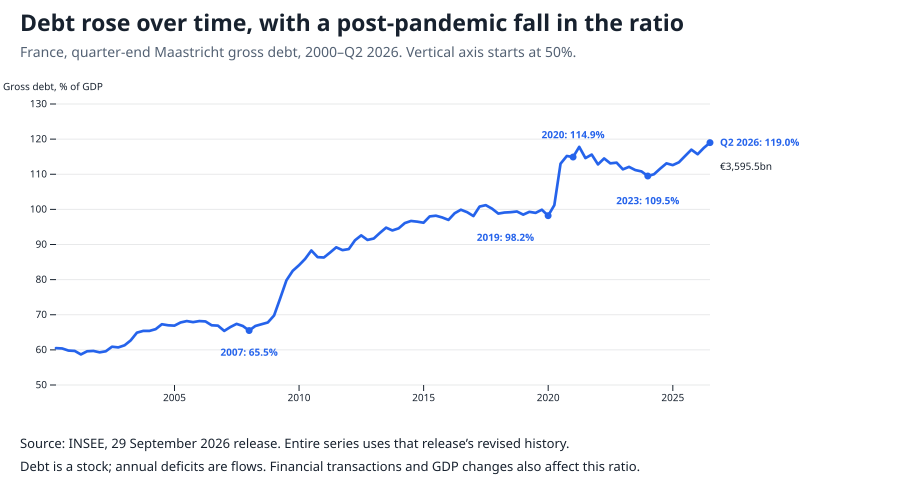

# Where France’s public money goes

France spent **€1,714.1 billion** in 2025 and raised **€1,561.6 billion**. The difference—€152.5 billion, or 5.1% of GDP—was that year’s public deficit. Every year in this 31-year record shows a shortfall.

These accounts cover central government, local government and social security. Revenue includes taxes, social contributions and other receipts. Comparing all public expenditure with tax receipts alone would exaggerate the gap.

## Most spending goes to social protection and health

In 2024, the latest detailed breakdown, social protection absorbed **41.5%** of spending and health another **15.6%**. Together they accounted for 57.1%. Education took 8.9%; defence, 3.2%.

Social protection includes pensions, disability, unemployment and family support. Old-age spending alone was €392.0 billion, already included in that category. Health is counted separately. Public-service salaries run across these purposes: a teacher’s pay belongs to education, a hospital worker’s to health. Adding salaries to the functional categories would count spending twice.

The largest category is not automatically the source of the worsening deficit. Social protection fell from 24.5% of GDP in 2014 to 23.7% in 2024, despite rising in euros.

## The gap has a revenue side

Between 2022 and 2024, spending fell from 58.4% to 57.0% of GDP. Revenue fell further, from 53.7% to 51.2%. The deficit therefore widened even as spending’s share of the economy declined.

[INSEE attributes the 2023 revenue weakness](https://www.insee.fr/fr/statistiques/8194620) chiefly to slower taxable bases, including corporation tax and property transactions; tax reductions also contributed. On spending, [INSEE identifies pension indexation following earlier inflation](https://www.insee.fr/fr/statistiques/8735252) as a major driver of the 2024 increase. Receipts and spending commitments respond to different influences and on different schedules.

The persistent element goes beyond a single bad year. The [IMF’s July 2026 assessment](https://www.imf.org/en/news/articles/2026/07/22/pr26255-france-imf-executive-board-concludes-2026-article-iv-consultation) estimates a 2025 structural deficit of 5.0% of potential GDP and a primary deficit of 3.0% of GDP. The first adjusts for the economic cycle and one-off factors; the second excludes interest. These estimates suggest that neither a temporary downturn nor debt interest alone accounts for the gap. They do not identify which individual policies should change.

The latest annual result was an improvement: the deficit narrowed from **5.8% to 5.1%** of GDP. [INSEE’s 2025 analysis](https://www.insee.fr/fr/statistiques/8997691) describes stronger receipts, including new revenue measures, and slower expenditure growth. The improvement left a substantial gap.

## Repeated deficits contribute to a growing debt stock

By June 2026, gross public debt stood at **€3,595.5 billion**, or **119.0% of GDP**. The ratio had fallen after the pandemic before rising again.

Debt is a stock; the deficit is an annual flow. Repeated borrowing contributes to the stock, but financial transactions and other adjustments also change it. The ratio additionally depends on GDP. These accounts explain the scale and persistence of the financing problem; they cannot assign decades of debt to a single programme or establish the likelihood of default.

## How this was made

The [dataset and definitions](https://github.com/datasets/datapressr/tree/main/datasets/france-public-finances), [offline build](https://github.com/datasets/datapressr/blob/main/datasets/france-public-finances/build.ts) and [chart script](https://github.com/datasets/datapressr/blob/main/site/stories/france-public-finances-make-charts.mjs) reproduce the figures from archived Eurostat and INSEE sources. Charts preserve their separate statistical vintages: annual accounts through 2025, spending functions through 2024, and debt through Q2 2026. Figures remain subject to revision.
