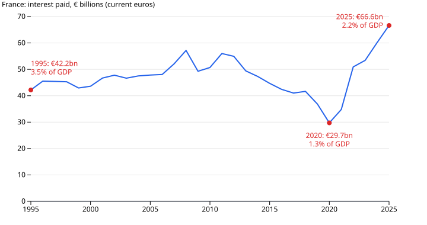

# France Has Run a Deficit Every Year Since 1995

French public debt reached 119.0% of GDP in mid-2026, the highest level in INSEE's quarterly series. It was 60.5% in early 2000.

The figure is gross Maastricht debt: what central government, local authorities and social security owe at the end of each quarter. In nominal terms that went from €854.8bn to €3,595.5bn. Debt is a stock. The annual deficit is the flow that adds to it, though loans, cash holdings and other financial transactions also move the stock.

## A deficit every year

Eurostat's accounts start in 1995. In every one of the 31 years since, the French government has spent more than it collected. The best year was 2000, with a deficit of 1.3% of GDP. The worst were 2009, at 7.4%, and 2020, at 8.9%.

The two steps in the debt chart line up with the two shocks. What stands out is that they stayed. The ratio went from 69.8% at the end of 2008 to 98.2% at the end of 2019, and from 101.2% to 115.2% in the first three quarters of 2020. Neither rise was reversed, and the deficits continued between crises. Germany, over the same years, ran a surplus in eight of them.

## Not a shortage of revenue

France does not collect little. In 2025 its government took in 52.1% of GDP, the most of the four countries and the EU average shown here, and 5.7 points above the EU27. It spent 57.2%, which is 7.7 points above the EU27. France had the largest deficit of the five in 2025, at 5.1% of GDP.

These are totals. They show the gap but not which spending or which tax should change. The accounts record what the money paid for, not what caused the shortfall.

## The bill for the stock

Interest is the cost of carrying the stock, and it is part of the spending above. The government paid €29.7bn in interest in 2020 and €66.6bn in 2025, more than twice as much. [INSEE](https://www.insee.fr/fr/statistiques/8997691) attributes the rise to the larger debt stock and the increase in interest rates since 2022.

Two numbers cut the other way. At 2.2% of GDP, interest is still below the 3.5% of 1995. And the debt ratio fell from 117.8% to 109.5% between early 2021 and the end of 2023 while deficits continued: the ratio depends on how fast GDP grows as well, which these accounts do not separate out. The 2025 deficit was also smaller than 2024's.

So the answer to "why" is arithmetic: 31 years of deficits, two shocks whose debt was never reversed, and a bill for that debt that has started to grow again. Whether this amounts to a "crisis" is a question about bond markets: yields, spreads, ratings. This dataset contains none of those.

## How this was made

Annual figures come from Eurostat's government accounts (`gov_10a_main`, update of 21 July 2026); quarterly debt from INSEE's release of 29 September 2026. Both are in the [france-public-finances](https://github.com/datasets/datapressr/tree/main/datasets/france-public-finances) dataset, built by [`build.ts`](https://github.com/datasets/datapressr/blob/main/datasets/france-public-finances/build.ts). The charts are drawn by [`french-debt-make-charts.mjs`](french-debt-make-charts.mjs), which reads every label from the data; re-running both reproduces these numbers. The argument and chart plan are in the [outline](french-debt-outline.md).

Eurostat's interest figure (`D41PAY`) for 2025 is €66.6bn. INSEE's annual article gives €64.7bn, using a different treatment of bank service charges. INSEE also reports 2025 spending and revenue as 57.3% and 52.2%, a later vintage; both sources give a 5.1% deficit. The dataset is at the `archived` stage: its own independent review is still outstanding.
