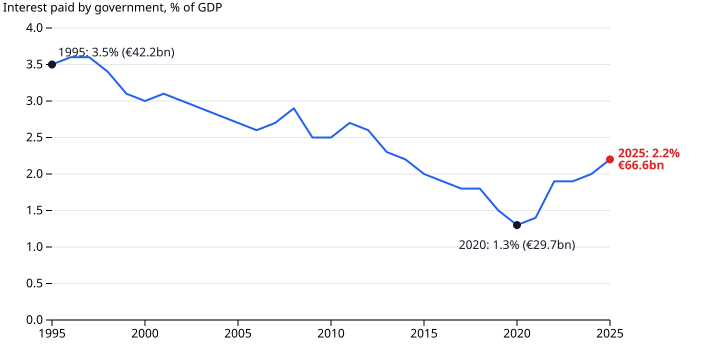

# France's debt problem is a gap that never closes

French public debt has doubled as a share of the economy since 2000: from 59.7% of GDP to 119.0% in mid-2026, or €3.6 trillion. No single bad year caused this. In every year on record here, from 1995 to 2025, the French state spent more than it collected.

## What the figures cover

The figures cover general government, meaning the central state, local authorities and the social security funds together. Debt is INSEE's quarterly Maastricht measure: gross, at face value, and set against a full year's GDP. Spending, revenue and interest come from Eurostat's annual accounts. Revenue includes social contributions and sales as well as taxes. The deficit is the yearly gap between spending and revenue. Debt is the stock that those gaps, along with some other financial transactions, build up.

## A deficit every year

The deficit was smallest in 2000, at 1.3% of GDP, and largest in 2020, at 8.9%. In 2025 it was 5.1%, or €152.5 billion. Debt climbed fastest around the 2008–09 financial crisis and the 2020 pandemic, and between those shocks it did not fall back to its earlier level. It stood at 69.8% at the end of 2008 and 98.2% at the end of 2019.

Revenue has not stood still. It reached 54.3% of GDP in 2017, and the deficit narrowed over the next two years. That improvement did not last: since 2019, spending has risen as a share of GDP and revenue has fallen. Debt did fall after the pandemic, from 117.8% in early 2021 to 109.5% at the end of 2023, but it has been rising again since.

## Not a low-tax country

In 2025 France raised 52.1% of its GDP in revenue, more than Italy, Germany, Spain or the EU average. It spent 57.2%, which was more again. Its deficit of 5.1% was the largest of the five. Germany, Italy and the EU as a whole also ran deficits. What sets France apart is the size of its gap, not the fact of having one. This comparison covers a single year, and recent figures can still be revised.

## Where the money goes

Social protection is the largest function, at 23.7% of GDP in 2024. In these accounts it excludes health. Old age accounts for 13.4 points of that total, up from 11.0 in 1995. Health rose from 6.9% to 8.9%. Together, old age and health grew by more than total spending did. That was possible because general public services, economic affairs, education and defence all shrank as shares of GDP. "Old age" here excludes survivors' pensions. And a large category is not proof that it caused the deficit.

## Why it bites now

Until 2020, debt rose while the cost of carrying it fell as a share of GDP. Interest took 3.5% of GDP in 1995 and 1.3% in 2020. By 2025 it was back up to 2.2%: €66.6 billion, against €29.7 billion five years earlier. INSEE attributes the recent rise to the larger stock of debt and to higher interest rates since 2022 ([Insee Première n° 2106, May 2026](https://www.insee.fr/fr/statistiques/8997691)).

These figures show the arithmetic, not the politics. They contain no bond yields, credit ratings or changes of government. They cannot say why successive governments ran these deficits, or which spending cut or tax rise would close the gap.

## How this was made

Data: [france-public-finances](https://github.com/datasets/datapressr/tree/main/datasets/france-public-finances), built from Eurostat government accounts (July and September 2026 updates) and INSEE's quarterly debt release of 29 September 2026. [`build.ts`](https://github.com/datasets/datapressr/blob/main/datasets/france-public-finances/build.ts) turns the archived source files into three CSVs, and [`france-debt-make-charts.mjs`](france-debt-make-charts.mjs) draws the charts from them. Re-running both reproduces every number here. Interest uses Eurostat's measure. INSEE's own 2025 figure, €64.7 billion, follows a different accounting convention. The dataset is still at the "archived" stage, because its debt-table parser awaits independent review. The argument and its checks are in the [outline](france-debt-outline.md) and [review](france-debt-outline-review.md).
