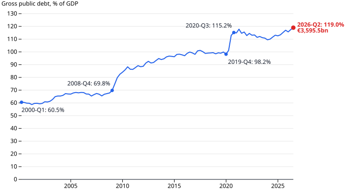
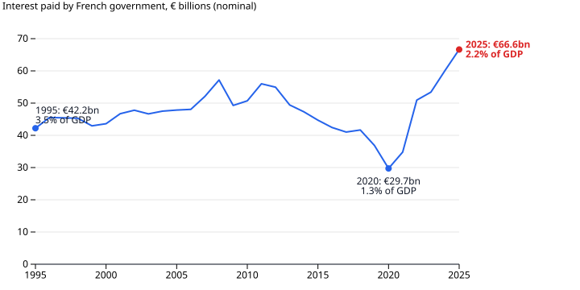

# France Hasn't Balanced a Budget in 31 Years

French public debt has roughly doubled relative to the economy since 2000, from 60.5% of GDP to 119.0%. The reason is simple arithmetic. In every year since 1995, the French state has spent more than it collected.

## What this measures

The figures cover French general government: the central state, local authorities and social security together. Debt is the Maastricht measure. That means gross, nominal debt as a share of annual GDP, as published quarterly by INSEE. In mid-2026 it stood at €3,595.5bn. The deficit is the gap between spending and revenue in a single year, from Eurostat's government accounts. Debt is a stock and the deficit is a flow. Each year's deficit is added to the stock.

The debt did not rise smoothly. It jumped in two steps, after the 2008 financial crisis and again in 2020. It fell for a while after the Covid peak, but it never returned to where it had been. By 2026 it had climbed past the 2020 level.

## A deficit every year

France's best year was 2000, with a deficit of 1.3% of GDP. In no year did it reach balance. The two recessions pushed the deficit to 7.4% in 2009 and 8.9% in 2020. Afterwards it shrank but never closed. No surplus ever paid down what those years had added.

Persistent deficits are common in Europe. The EU27 as a whole ran one in every year as well. The difference is size. In 2025 France's deficit was 5.1% of GDP, against 3.1% for the EU. Since 2002 France's deficit has been larger than the EU's every year.

## Not a low-tax country

France does not run deficits because it collects little. In 2025 its revenue was 52.1% of GDP, more than Germany, Italy, Spain or the EU average. Its spending was 57.2%, which is higher still and also the highest of the group. The gap between the two is the deficit.

These accounts cannot say whether the gap should close by spending less or by collecting more. They show only that France has not closed it.

## The wrinkle: interest is climbing again

For two decades a growing debt cost less and less to carry. Interest paid fell to €29.7bn in 2020. By 2025 it was €66.6bn, more than double in five years. INSEE [attributes the rise](https://www.insee.fr/fr/statistiques/8997691) to "the rise in the stock of debt and the rise in interest rates since 2022". The rest of this story's data does not test that explanation.

There is a caveat. At 2.2% of GDP, the interest bill is still below the 3.5% of 1995, so it is not yet extreme by France's own past. What has changed is the direction. Interest is now a growing cost added to a deficit that has never closed. INSEE's own figure for 2025 is €64.7bn, because it treats one bank-service charge differently. This story uses Eurostat's measure.

This data does not cover the market and political side of a "crisis": bond yields, credit ratings, budget votes. It covers the accounts underneath, which show a debt ratio at the highest point in the series and still rising.

## How this was made

The figures come from the [france-public-finances](https://github.com/datasets/datapressr/tree/main/datasets/france-public-finances) dataset: Eurostat government accounts (update of 21 July 2026) and INSEE quarterly debt (release of 29 September 2026). Its [`build.ts`](https://github.com/datasets/datapressr/blob/main/datasets/france-public-finances/build.ts) turns the archived source files into CSVs. [`french-debt-make-charts.mjs`](french-debt-make-charts.mjs) draws the charts from those CSVs. Re-running both reproduces every number here. The argument is fixed in the [outline](french-debt-outline.md). The dataset's status is still `archived`, because the independent review of its HTML parser is pending.

---

## Friction notes

- **The outline review is outstanding.** No independent reviewer approved the outline. The attempt to run one was blocked by the sandbox's network policy. See [french-debt-review.md](french-debt-review.md). Treat this as a draft until that review passes.
- **The author's voice pass is outstanding.** This is the AI draft. Nobody has rewritten it in a human author's voice.
- **Numbers not on a chart (exempt):** INSEE's €64.7bn interest figure, which is an attributed external figure, and "since 2002 … larger than the EU's every year", which comes from the same rows as chart 2 (France's deficit exceeded the EU27's in 26 of 31 years: 1997, 2000 and 2002–2025).
- **"Why" pulls toward causation.** The accounts give an arithmetic answer (deficits accumulate into debt) and a comparison. A policy explanation needs outside sources. Here those were limited to the archived INSEE article, because the run was offline.
