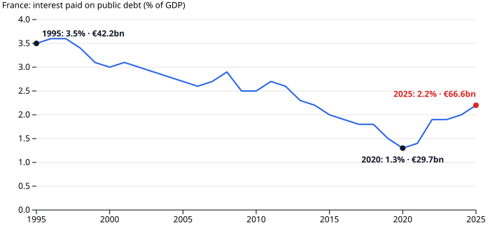

# Why France's Debt Keeps Climbing

French public debt reached 119.0% of GDP at the end of June 2026, the highest point since the series began in 2000. It rose because the government has borrowed every year.

The figures are official. INSEE, the French statistics office, publishes gross public debt under EU (Maastricht) rules each quarter, covering central government, local government and social security together. Eurostat publishes the annual revenue, spending and balance for the same scope. All values are nominal and given as a share of GDP.

## A deficit in every year

France has not run a budget surplus in any year from 1995 to 2025. Germany ran surpluses through most of the 2010s and Spain did in the mid-2000s. France did not.

Being permanently in deficit does not make France unique: Italy and the EU27 as a whole also had no surplus year in this period, and Italy's deficits were wider than France's from 2020 to 2023. The difference is now. In 2024 and 2025 France had the widest deficit of the four. It narrowed in 2025, to 5.1% of GDP, but Italy and the EU27 were at 3.1%.

The debt ratio rises in steps. It jumped from 65.5% at end-2007 to 84.1% at end-2009, and from 98.2% at end-2019 to 117.8% in early 2021. It did not come back down after either jump. Those jumps line up with the 2008–09 financial crisis and the Covid-19 pandemic. The data does not split them into lost revenue, emergency spending and smaller GDP.

## High revenue, higher spending

French revenue is not low by European standards. It was 52.1% of GDP in 2025, against 46.4% for the EU27, and the highest of the four big economies in every year since 1995. Its spending, at 57.2%, was also the highest in every year. The deficit is the space between the two. Spending rose to 58.0% in 2009 and 61.7% in 2020. It has since fallen back but stays above where it was before 2009. This comparison cannot say which side should move.

## The wrinkle: interest is rising again

Interest adds to the deficit each year. France paid €29.7 billion in 2020 and €66.6 billion in 2025, more than twice as much. INSEE [attributes the rise](https://www.insee.fr/fr/statistiques/8997691) to the larger stock of debt and to higher interest rates since 2022. This dataset contains neither interest rates nor the stock-flow split, so it does not test that explanation.

Two numbers weaken this picture. As a share of GDP, interest is 2.2%, still below the 3.5% of 1995. And the debt ratio fell from 117.8% to 109.5% between early 2021 and end-2023 while deficits continued and the euro amount kept rising, from €2,753 billion to €3,103 billion. A ratio also moves with GDP, its denominator. The deficit alone does not set it.

Whether this amounts to a "crisis" is a question for bond markets. This dataset holds no yields, spreads or ratings, so it cannot answer that. What it does show is that the debt rises because the gap has never closed.

## How this was made

Data: [france-public-finances](https://github.com/datasets/datapressr/tree/main/datasets/france-public-finances), from Eurostat (annual accounts, update of 21 July 2026) and INSEE (quarterly debt, release of 29 September 2026). The dataset is built by [`build.ts`](https://github.com/datasets/datapressr/blob/main/datasets/france-public-finances/build.ts) from an archived snapshot. It is still at `archived` status while its own review is outstanding. The charts come from [`french-debt-make-charts.mjs`](french-debt-make-charts.mjs). Re-running it reproduces every number above. The argument and its review are in the [outline](french-debt-outline.md).

## Friction notes

- **Author's voice pass: outstanding.** This is the final draft from the story skill; no human voice pass has been done.
- Review: self (blind run, no reviewer available). That applies to both the outline review (APPROVED in round 2, recorded in the outline) and the prose-against-outline check below.
- The charts were not inspected visually. They were checked from the SVG source only: text labels, label coordinates against line positions, axis ticks and `viewBox` (720 wide). Two collisions and a label bug (euro amounts printing as "€1bn") were found this way and fixed before the charts commit.
- Data numbers in the prose that are not chart labels: none. The only numbers in the prose missing from SVG text are years. "2008" names the financial crisis (2008–09), "2022" is part of INSEE's attributed explanation, and "2024" is a year whose comparison can be read off the balance chart's lines but has no label. "1995 to 2025" and "since 2000" are the chart windows. Counts of years ("every year") are visible on the charts but not labelled.
- Weakening numbers from the outline that are not on a chart: Italy's 2025 interest share (3.9%) is left out. The 2024→2025 narrowing of France's deficit is stated without its 2024 value (5.8%), which is not labelled on the chart.
- Prose-against-outline check (review: self, blind run, no reviewer available): every claim maps to an outline beat; no causal claim beyond the outline; INSEE's explanation is attributed and marked untested. One correction, applied before this commit: add the 2025 narrowing of France's deficit (beat 3, weakening). Verdict: APPROVED. Charts commit `d066c1f`; outline approved at `acdb71e`.
- The question asked about a "debt crisis". The data measures the debt and the deficit, not market stress, so the story answers why the debt keeps rising and says so.
- Repository links assume the repo is `github.com/datasets/datapressr`. This scratch repository has no remote to confirm that.
