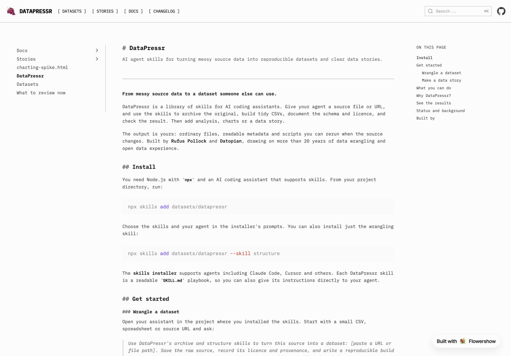

The [homepage](../README.md) now puts installation and separate dataset and data-story examples up front, with a real story chart, clearer benefits and credits. We have switched to the monospace theme and organised the [docs](../docs/README.md) around setup, source discovery and storytelling.

