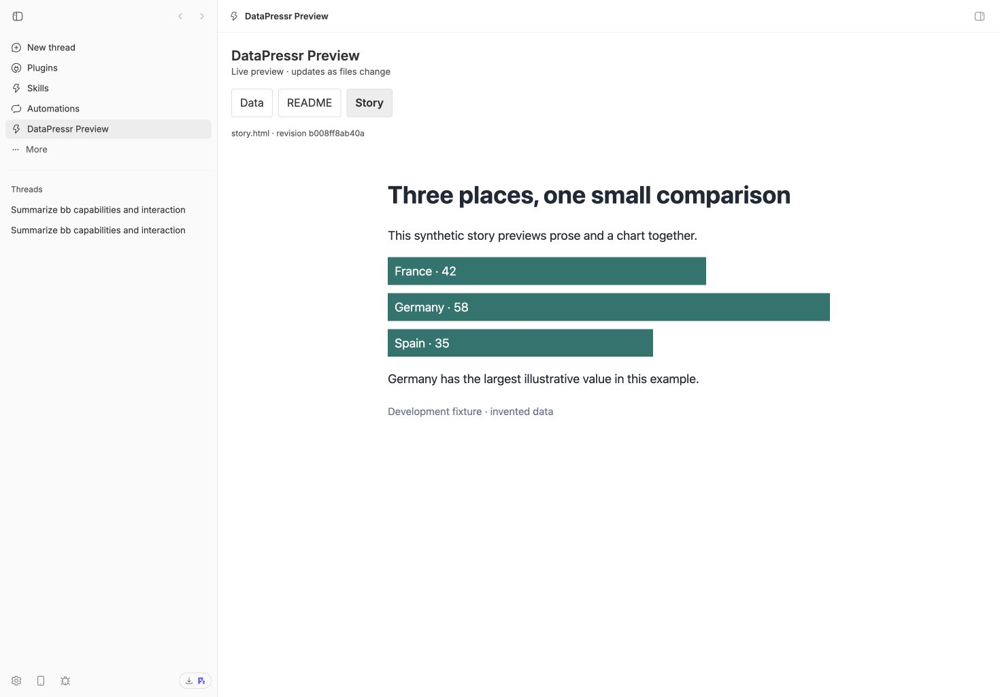

A working proof of concept previews data tables, dataset READMEs, and stories with charts inside BB, including beside an AI conversation, and updates the preview as files change. We also proved that the AI can build, reload, and visually test the plugin itself—an essential step toward a usable data workspace.

This is a local prototype using sample files, not a released plugin yet.

