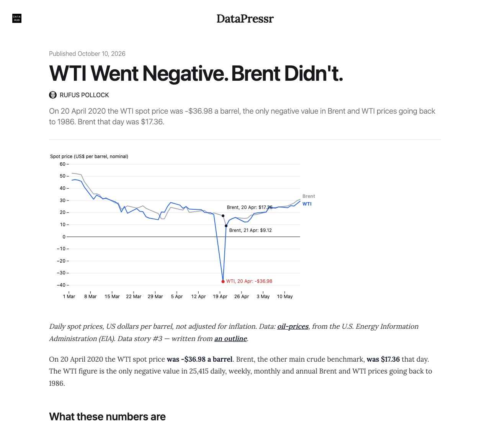

"WTI Went Negative. Brent Didn't." is now live on DataHub at [datahub.io/datapressr/wti-went-negative](https://datahub.io/datapressr/wti-went-negative), beside the [oil-prices dataset](https://datahub.io/datapressr/oil-prices) it is built from, and each now links to the other. It is published as a draft pending the author's voice pass; the site page stays as the working copy.

