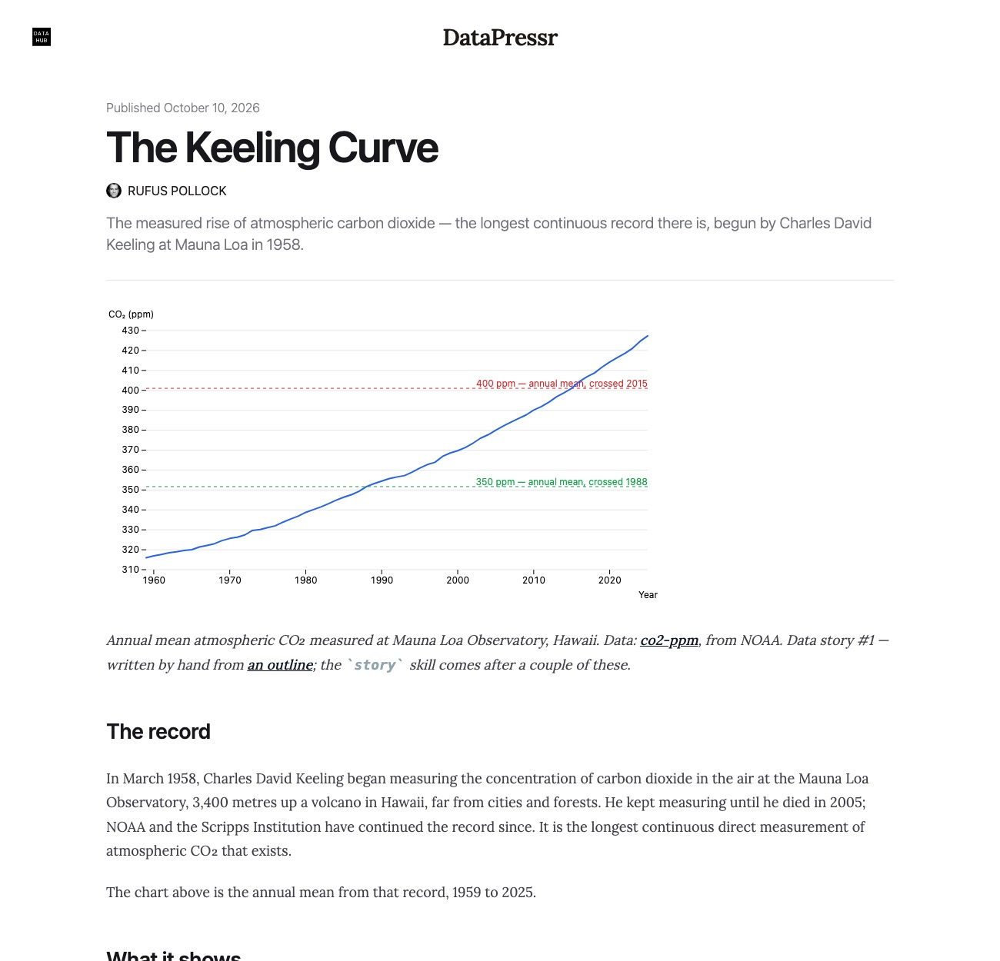

The other three data stories are now live on DataHub beside the oil story: [The Keeling Curve](https://datahub.io/datapressr/keeling-curve), [Planetary Boundaries](https://datahub.io/datapressr/planetary-boundaries-scoreboard) and [Where France's public money goes](https://datahub.io/datapressr/where-frances-public-money-goes). Like the oil story they are drafts pending the author's voice pass, and the site pages stay as the working copies.

Six more datasets are published with them, so every story's data link now lands on a DataHub dataset page, and those pages link back to the stories: [co2-ppm](https://datahub.io/datapressr/co2-ppm), [france-public-finances](https://datahub.io/datapressr/france-public-finances), [airports](https://datahub.io/datapressr/airports), [population-growth](https://datahub.io/datapressr/population-growth), [tesla-quarterly-deliveries](https://datahub.io/datapressr/tesla-quarterly-deliveries) and [us-natural-hazard-statistics](https://datahub.io/datapressr/us-natural-hazard-statistics). The [datasets page](../datasets.md) links each one. Everything is listed at [datahub.io/datapressr](https://datahub.io/datapressr).

