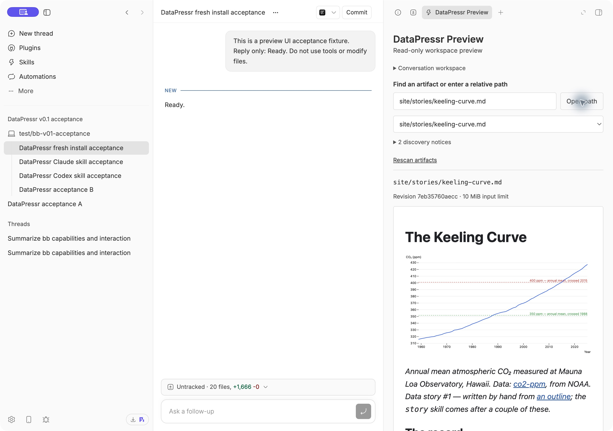

# Preview datasets and stories in BB

DataPressr Preview v0.1 shows your dataset, README or data story beside the conversation in BB. Ask Codex or Claude Code to change files using the DataPressr skills; the selected preview updates automatically. The viewer is read-only and opens without starting an agent call.



## Requirements

- A local BB installation with the `bb` command available. v0.1 was tested on macOS with **BB 0.44.0** and **plugin SDK 0.5.29**.
- Node with native TypeScript execution: **Node 22.18 or newer**. The acceptance run used Node 25.8.1 and npm 11.12.1.
- A local checkout of the full DataPressr repository, including `desktop-app/` and `skills/`.
- To request changes, an already configured provider in BB. Actual validation and edit runs passed with **Codex CLI 0.159.2, 6.1-Sol**, and **Claude Code 2.1.286, Opus 5.5**. Both used medium reasoning. Viewing files does not require making a model call.

Remote BB execution hosts are not supported in this version. The plugin uses the conversation's actual local worktree, which may differ from the project's default directory.

## Install from source

Launch BB, then open a terminal in your DataPressr checkout:

```sh
cd desktop-app
npm ci --ignore-scripts
npm run build
bb plugin install . --yes
```

Run these commands from inside `desktop-app/`. The build generates the plugin bundles and copies the eight canonical skills with their reference files. Keep this checkout in place: a local source installation points at it. The plugin ID is `datapressr-preview`; installing a new path replaces its source under that same ID.

This installs the working v0.1 viewer. The older fixed-fixture proof of concept under `desktop-app/experiments/` is retained for reference and is not the installation target.

## Open a preview

1. Open or create a BB conversation in your local DataPressr project or worktree.
2. Show the right panel, click **Open new tab (+)** and choose **DataPressr Preview**.
3. Search for a file, choose a dataset's README or CSV, or enter an exact workspace-relative path and click **Open path**.
4. Keep the preview visible while asking the agent to edit the underlying file. Updates normally appear within two seconds for small files. Rebuilding an embedded local chart refreshes the story even when its Markdown is unchanged.

Try these existing files:

```text
datasets/climate-and-environment/co2-ppm/README.md
datasets/climate-and-environment/co2-ppm/data/co2-annual-global.csv
site/stories/keeling-curve.md
```

The exact selected path is shown above the preview. Expand **Conversation workspace** to check its root and environment. Each conversation/environment remembers its own selection across tab closure, app reload and plugin reinstall. A missing file stays selected and recovers when restored; the viewer does not silently choose a different file.

Use **Rescan artifacts** after creating new files. Discovery groups local dataset resources using `datapackage.json` and also finds loose documents and charts. Invalid metadata does not hide otherwise valid files. A direct relative path works even when discovery omitted the file.

## Use the DataPressr skills

The plugin supplies `capture`, `archive`, `init`, `structure`, `enrich`, `story`, `validate` and `push`. Open a new conversation after installing or updating. Select a skill from BB's `/` or `$` command menu, or ask for it by name and identify the dataset directory.

For a first check, ask:

> Use the DataPressr validate skill on datasets/climate-and-environment/co2-ppm. Report its output without changing or publishing anything.

The canonical skill uses the dataset's `scripts/validate-datapackage.mjs` when present; for an older dataset without it, the skill documents its fallback. The BB acceptance run used a disposable copy containing the validator. The plugin preserves all existing review and publishing gates. Installing skills is not approval to publish or to bypass story outline review.

The repository's `skills/` remains the only source of instructions. `npm run build` regenerates the ignored `desktop-app/generated-skills/` directory; `npm run skills:check` verifies that its files match. Do not edit generated skills or install another competing copy. Existing repository Claude symlinks were retained during acceptance; BB's tested command listings contained one entry per skill.

These workflows are supported in the DataPressr repository. Making every skill self-contained in an arbitrary empty project is separate work.

## Supported files and limits

| Preview | Behavior |
| --- | --- |
| CSV | Read-only table, sticky headings, scrolling, at most 200 data rows and 100 displayed columns; samples are labeled, not presented as full-dataset counts |
| Markdown | Rendered prose, tables, hidden frontmatter, local images and relative document links |
| Static HTML | Local CSS and images; scripts, forms and embeds are disabled |
| SVG, PNG, JPEG, WebP | Standalone image preview with preserved aspect ratio |

Each input or asset is limited to **10 MiB**. Documents allow up to **100 referenced assets** and **30 MiB** of source/expanded bundle content. Discovery stops at **10,000 entries** and skips hidden, archive, dependency and build directories. It displays at most 100 search matches at a time; refine the search or use an exact path.

Valid parent-relative links within the workspace work. Absolute paths, traversal outside the workspace and escaping symlinks are rejected. Remote assets are not downloaded; ordinary external hyperlinks can be opened deliberately. JavaScript charts, application servers, fonts, XLSX, Parquet, PDF and automatic charts from `datapackage.json.views` are outside v0.1.

Only active, visible previews poll. Catalog rescans are manual. A temporarily invalid or missing file produces an explicit error and is retried; old content is cleared. Document scroll position is retained where practical.

## Update or disable

After updating your checkout, run the install sequence again from `desktop-app/`. It rebuilds both code and canonical skills. To check the installed path and status:

```sh
bb plugin source datapressr-preview
bb plugin list
```

To unload the viewer and its bundled skills while retaining preferences:

```sh
bb plugin disable datapressr-preview
```

Restore it with `bb plugin enable datapressr-preview`. Reinstall from a new source path before moving or removing the currently installed checkout. No marketplace publication is required.

## Troubleshooting

| Symptom | What to check |
| --- | --- |
| Preview action missing | Confirm the plugin is enabled/running; rebuild and reinstall, then reopen the panel |
| Wrong or unavailable workspace | Expand Conversation workspace; use a ready local environment belonging to this conversation |
| New file not listed | Rescan, refine the search, or enter its relative path directly |
| File unavailable | Check the displayed path, permissions, file size and whether the writer has finished; the preview retries automatically |
| Image or CSS missing | Read the visible asset warning; use a local supported file within the workspace and within the limits |
| Interactive chart is static | Scripts are disabled; have the agent emit a static SVG or PNG |
| Skills absent | Rebuild, open a new conversation, and inspect the project/environment-aware catalogs below |
| Install error | Change into `desktop-app/` before running npm; use the committed lockfile and the tested BB/SDK versions |

Developer diagnostics, replacing IDs with those of your test project and environment:

```sh
bb plugin logs datapressr-preview
bb skill list --project PROJECT_ID --environment ENVIRONMENT_ID --json
bb project commands PROJECT_ID --provider codex --environment ENVIRONMENT_ID --json
bb project commands PROJECT_ID --provider claude-code --environment ENVIRONMENT_ID --json
```

## Developer verification

From `desktop-app/`:

```sh
npm ci --ignore-scripts
npm test
npm run typecheck
npm run build
npm run skills:check
bb plugin install . --yes
```

`bb plugin dev .` rebuilds/reloads during development; stop it before testing content refresh. Use dedicated test conversations and a disposable worktree. Verify actual rendered README/CSV/story output, provider edits, chart-only rebuilds, missing-file recovery, two-worktree isolation, reopen/reload and clean installation yourself. Do not substitute unit tests for visual inspection.

The [acceptance evidence](https://github.com/datasets/datapressr/blob/main/docs/benchmarks/bb-preview-v01.md) records commands, tested versions, provider transcripts, screenshots and limitations. The [source README](https://github.com/datasets/datapressr/blob/main/desktop-app/README.md) describes the adapter and document isolation.

## Make a demo video

The [demo script and screenshot storyboard](https://github.com/datasets/datapressr/blob/feat/bb-v01/docs/demos/bb-preview-v01.md) provides a roughly two-minute introduction, exact narration, existing still-image assets and prompts for a live recording. It is a production script; a rendered video is not included.
