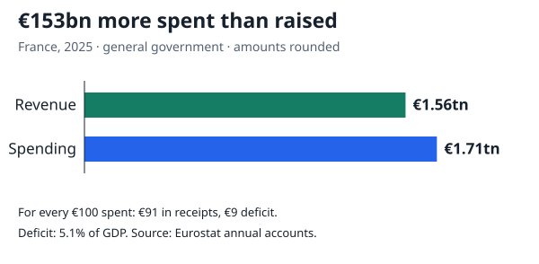
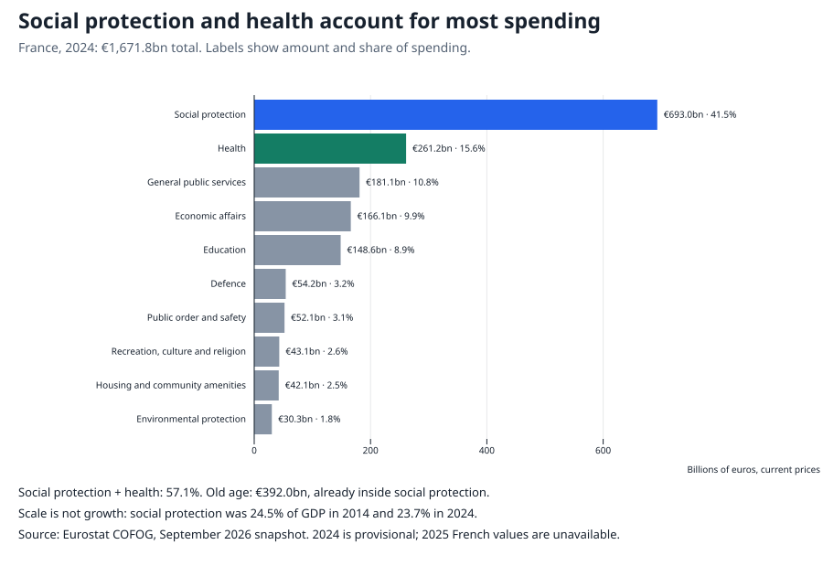
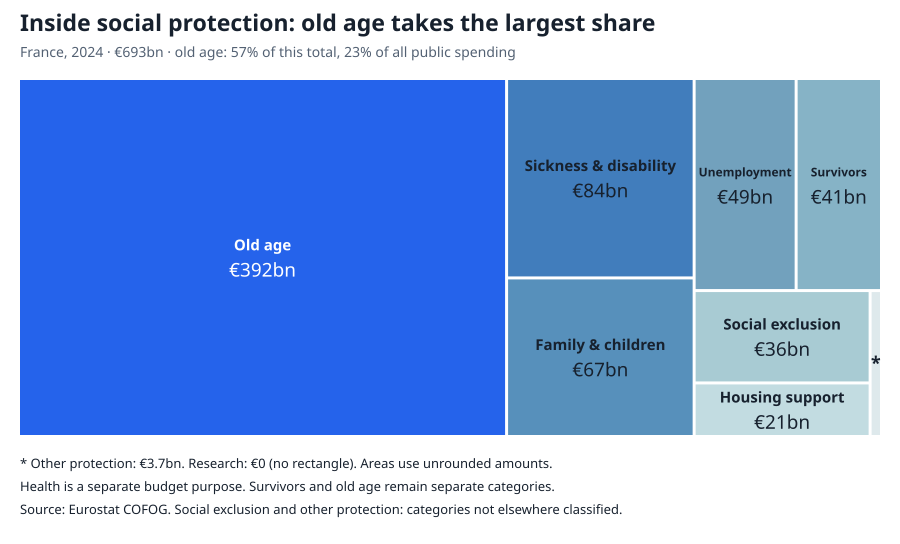
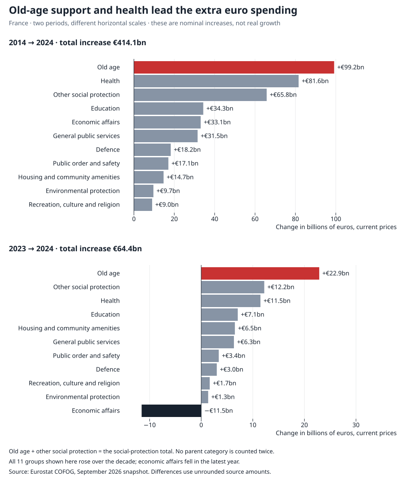
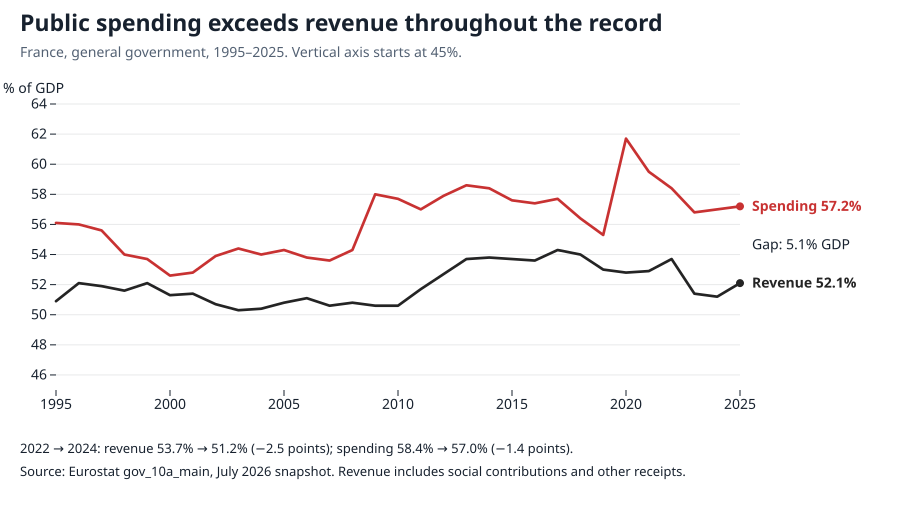
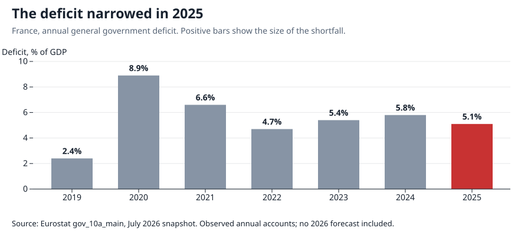

# Where France’s public money goes

**[Read on DataHub](https://datahub.io/datapressr/where-frances-public-money-goes)**, where this story is published beside its dataset. This page is the working copy.

France spent **€1.7 trillion** in 2025, about **€153 billion more than it raised**. These figures cover central government, local government and social security; receipts include taxes, social contributions and other income.

## Where the money goes

Social protection and health take **57.1% of public spending**. The latest detailed breakdown is for 2024, a year behind the headline accounts. But “social protection” is a broad label. What is inside it?

## “Old age” means retirement income and support for older people

The **€392 billion** old-age category includes retirement pensions, care allowances, accommodation, home help and administration of those schemes. The [UN’s classification](https://unstats.un.org/unsd/classifications/Econ/Structure/Detail/en/4/10_2_0) also explicitly includes government-employee and military pension schemes.

Survivors’ benefits have a separate category. Healthcare for older people belongs under health. Salaries run across these purposes; adding them as another slice would double-count spending.

**Does ageing explain the growth? Partly.** [DREES links rising pensioner numbers](https://www.drees.solidarites-sante.gouv.fr/sites/default/files/2026-03/La%20protection%20sociale%20en%20France%20et%20en%20Europe%20en%202024.pdf#page=36) to baby-boom retirements and longer lives, while retirement-age reforms slow that growth. Pension costs depend on both how many people receive payments and how much they receive.

For 2024, [DREES identifies inflation-linked pension increases as the main driver](https://www.drees.solidarites-sante.gouv.fr/sites/default/files/2026-03/La%20protection%20sociale%20en%20France%20et%20en%20Europe%20en%202024.pdf#page=54). Basic pension rates were uprated by **5.3%** from January; the general scheme (CNAV)’s year-end direct-pension recipient count rose **1.0%**. These are different measures, not percentages to add together. They show why ageing alone is an incomplete explanation; they do not apportion the whole old-age budget’s growth.

## What is growing?

Over the decade, **old-age support and health made the largest additions to the euro bill**. The latest year is more mixed: economic-affairs spending fell as [energy-price support was withdrawn](https://www.insee.fr/fr/statistiques/8735252).

These are euros at the prices of each year. Some growth buys more services or supports more people; some pays higher prices or raises benefit amounts. The chart does not measure inflation-adjusted growth.

## More euros can still mean a smaller share of GDP

Social protection grew from **€528bn to €693bn—up 31%** between 2014 and 2024. Yet its GDP share fell from **24.5% to 23.7%**, because nominal GDP grew faster. A falling share here does **not** mean fewer euros were spent.

Old age illustrates the distinction: **€293bn became €392bn**, while **13.6% of GDP became 13.4%**. Health grew on both measures. The longer history also matters: social protection’s GDP share remains above its **22% in 1995**.

## The deficit has a revenue side, too

The deficit widened between 2022 and 2024 even though spending fell relative to GDP: **receipts fell further**. [INSEE points to weaker taxable bases and tax reductions](https://www.insee.fr/fr/statistiques/8194620). Spending exceeded receipts throughout this 31-year record. Nor is interest the whole problem: the [IMF estimates a 2025 deficit before interest of 3% of GDP](https://www.imf.org/en/news/articles/2026/07/22/pr26255-france-imf-executive-board-concludes-2026-article-iv-consultation).

The deficit improved to **5.1% of GDP in 2025**, with [stronger receipts and slower spending growth](https://www.insee.fr/fr/statistiques/8997691). A large spending category is not automatically the cause of each deterioration.

By June 2026, debt stood at **€3.6 trillion**, or **119% of GDP**. Deficits add to the debt stock; financial transactions and GDP growth also affect the ratio. These accounts do not predict default.

## How this was made

The [three CSVs and definitions](https://github.com/datasets/datapressr/tree/main/datasets/france-public-finances), [offline data build](https://github.com/datasets/datapressr/blob/main/datasets/france-public-finances/build.ts) and [chart script](https://github.com/datasets/datapressr/blob/main/site/stories/france-public-finances-make-charts.mjs) reproduce the figures from archived Eurostat and INSEE releases. Amounts are rounded only for display. DREES supplies pension context, not replacement totals: its accounting scope differs. Release dates vary and figures remain subject to revision.
