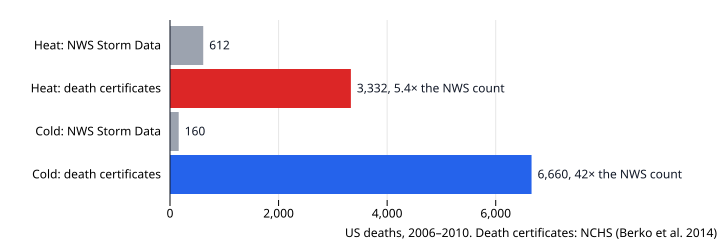

# Heat Is the Quiet Killer

![Horizontal bars of US weather deaths in 1997–2025 by hazard, as attributed by the National Weather Service. Heat 5,366, 2.5 times tornadoes, with its bar split into other states 3,376 and Arizona 1,990. Then tornado 2,167, flash flood 2,015, tropical storm / hurricane 1,505, rip current 1,438, lightning 893, cold 849 and thunderstorm wind 842. A dashed line at 4,182 marks tornadoes and flash floods combined; heat is 1.3 times that, but the other-states part of the heat bar alone stops short of it.](heat-quiet-killer-ranking.svg)

*US weather deaths by hazard, 1997–2025, as attributed by the National Weather Service. Data: [us-natural-hazard-statistics](https://github.com/datasets/datapressr/tree/main/datasets/climate-and-environment/us-natural-hazard-statistics), from the NWS. Written from [an outline](heat-quiet-killer-outline.md).*

In the National Weather Service's count, heat killed **5,366** people in the United States from 1997 to 2025. That is **2.5 times** as many as tornadoes and **1.3 times** tornadoes and flash floods combined. Heat comes first.

The ranking is real, but it measures what reaches the count as well as what kills. The count misses most heat deaths, and it misses most cold deaths too.

## What these numbers are

The NWS builds them from *Storm Data*: local forecast offices log each weather event and the deaths they attribute to it, direct or indirect. Each death goes to one event type. The NWS itself says the official US source for cause of death is the CDC, not the weather service.

Two caveats from the dataset matter here. The source says hurricane rows count wind deaths only, with surge and flooding booked elsewhere, although the 2005 row, which is mostly Katrina, plainly holds more than wind. And damage figures are never adjusted for inflation; this story uses only deaths.

## What the data says

- **Heat leads most years.** It is the single deadliest hazard in 19 of the 29 years. Even all flood types added together fall short of it.
- **It is not one heatwave.** The largest year is 2023, with **555** deaths. Before 2019, only 1999 passes 300.
- **It does not lead every year.** Tornadoes led in 2008 and 2011, and in 2025, still preliminary, flash floods killed more.

## The wrinkle: who reports

A heat death enters *Storm Data* when a medical finding reaches the local forecast office, and generally only if the weather met that office's own heat-advisory or warning threshold, according to the NWS's [instructions to its offices](https://www.weather.gov/media/directives/010_pdfs/pd01016005curr.pdf). So what gets counted depends on place.

Arizona shows it. Apart from **51** in 2005, the state barely appears before 2019. Then it is **143 of 187** in 2019 and **448 of 555** in 2023. In 2020 the NWS recorded **13** heat deaths in the rest of the country. Arizona's deaths did not start in 2019. Maricopa County, which includes Phoenix, confirmed at least 150 heat deaths in 2016, its public health department [reported](https://usclimateandhealthalliance.org/post_resource/pheonixs-heat-killed-more-people-in-2016-than-ever-before) at the time, when the NWS had a handful for the whole state. In 2023 the county counted [645](https://www.maricopa.gov/CivicAlerts.aspx?AID=3222), more than the NWS recorded for the whole country. No source found says why Arizona's deaths began reaching the count. Arizona is the largest case, not the only one: Nevada's count also jumped from 2013, and Oregon's in the 2021 heat dome.

This matters for the headline. Without Arizona, heat is **3,376**: still above tornadoes or flash floods alone, but below the two combined. And the rise since 2019 in the NWS series is mostly Arizona arriving in it, so the series cannot show whether heat deaths are increasing. Death certificates suggest they are: heat-related deaths rose by 16.8% a year from 2016 to 2023, reaching 2,325 in 2023, according to [Howard and colleagues in *JAMA*](https://jamanetwork.com/journals/jama/fullarticle/2822854).

## A quieter killer

Death certificates count differently. A certificate can list heat or cold as a contributing cause, not only the main one, and nobody has to tie the death to a weather event. For 2006–2010, the National Center for Health Statistics [counted](https://www.cdc.gov/nchs/data/nhsr/nhsr076.pdf) **3,332** heat-related deaths, **5.4 times** the NWS's **612**.

For cold the gap is far wider: **6,660** on death certificates, **42 times** the NWS's **160**. On death certificates, cold killed about twice as many people as heat. That is not a one-off: over 1999–2022, certificates record 40,079 cold-related deaths ([Liu and colleagues, *JAMA*](https://jamanetwork.com/journals/jama/fullarticle/2828342)), against 21,518 heat-related deaths over 1999–2023, with slightly different definitions.

So heat is the deadliest hazard *in the weather service's record*, not necessarily in the country. Hurricanes are undercounted too: the 2017 hurricane row, the year of Hurricane María, has a few dozen deaths, against [an estimated 2,975 excess deaths](https://gwtoday.gwu.edu/node/9876) in Puerto Rico. Heat is quiet because few of its deaths are recorded as weather deaths. Cold is quieter still.

## How this was made

The deaths by hazard come from [`us-natural-hazard-statistics`](https://github.com/datasets/datapressr/tree/main/datasets/climate-and-environment/us-natural-hazard-statistics), built from the NWS's annual PDF summaries by [`build.ts`](https://github.com/datasets/datapressr/blob/main/datasets/climate-and-environment/us-natural-hazard-statistics/build.ts). The Arizona split comes from the NWS's separate per-state heat summaries, snapshotted with their hashes in [`heat-quiet-killer-src/`](heat-quiet-killer-src/PROVENANCE.md); every year's state total matches the dataset's heat row, and the chart build checks it. The charts are built by [`heat-quiet-killer-make-charts.mjs`](https://github.com/datasets/datapressr/blob/main/site/stories/heat-quiet-killer-make-charts.mjs); re-running it reproduces them exactly. The death-certificate figures are quoted from the linked studies.

## Friction notes

- **The seed claim was true and fragile.** "More than tornadoes and flash floods combined" holds only with Arizona. Checking it needed the NWS's per-state heat summaries, which the dataset lists as a follow-up and does not extract.
- **Outline review changed the argument.** Round 1 caught that the death-certificate comparison had been applied to heat only; on certificates cold outnumbers heat. Three rounds in total; see the outline.
- **Exempt numbers** (not on a chart):
  - 19: dataset-wide count of years heat leads
  - 29: dataset-wide count of years
  - 300: threshold in a dataset-wide statement
  - 150: attributed Maricopa County figure
  - 645: attributed Maricopa County figure
  - 16.8%: attributed JAMA trend
  - 2,325: attributed JAMA figure
  - 40,079: attributed JAMA figure
  - 21,518: attributed JAMA figure
  - 2,975: attributed GWU estimate
- **Author's voice pass: outstanding.** This prose is an AI draft rendered from the approved outline; the "sounds like me" pass has not been done.
