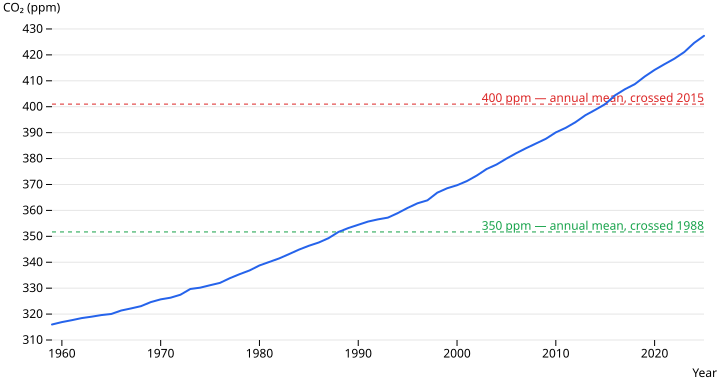
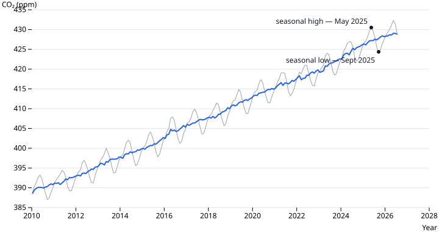

# The Keeling Curve

*Annual mean atmospheric CO₂ measured at Mauna Loa Observatory, Hawaii. Data:
[co2-ppm](../datasets.md), from NOAA. Data story #1 — written by hand from
[an outline](keeling-curve.outline.md); the `story` skill comes after a couple of
these.*

## The record

In March 1958, Charles David Keeling began measuring the concentration of carbon
dioxide in the air at the Mauna Loa Observatory, 3,400 metres up a volcano in
Hawaii, far from cities and forests. He kept measuring until he died in 2005; NOAA
and the Scripps Institution have continued the record since. It is the longest
continuous direct measurement of atmospheric CO₂ that exists.

The chart above is the annual mean from that record, 1959 to 2025.

## What it shows

- **316 ppm in 1959. 427 ppm in 2025** — parts per million of dry air.
- **It has risen every year.** The annual mean has not once fallen in 67 years.
- **The rise is getting faster:** about 0.9 ppm/year across the 1960s, about
  2.6 ppm/year across the last decade.
- It passed **350 ppm** (a figure often cited as a safe ceiling) around **1988**,
  and **400 ppm** in **2015**.

## The seasonal cycle

Zoom in to the monthly data and the line turns into a sawtooth:

CO₂ drops about 6 ppm every northern-hemisphere summer, as plants across the
larger northern landmass grow and take up carbon, then climbs back over the
winter. Keeling was the first to measure this annual cycle. The smooth line
underneath is the same data with the seasonal swing removed — the trend that
doesn't reverse.

## How this was made

The NOAA source is a text file, `co2_mm_mlo.csv`. It opens with about 40 comment
lines, uses `-1` / `-9.99` / `-0.99` to mean "no measurement" rather than leaving
cells blank, and splits the date across a year column and a month column.
[`build.ts`](https://github.com/datasets/datapressr/blob/main/datasets/climate-and-environment/co2-ppm/build.ts)
strips the comments, converts the sentinels to empty cells, assembles an ISO date,
and writes two typed CSVs — monthly and annual. Re-running it produces identical
output. Full notes, including how this compares with the older community version
of the dataset (whose auto-updater silently mislabelled two columns after NOAA
changed the file), are in the
[dataset README](https://github.com/datasets/datapressr/blob/main/datasets/climate-and-environment/co2-ppm/README.md).

## Friction notes

For the future `story` / charting skills:

- **Charting was the awkward part.** The chart syntax for stories isn't decided
  yet, so both charts here are produced by a hand-written SVG generator,
  [`make-charts.mjs`](https://github.com/datasets/datapressr/blob/main/site/stories/make-charts.mjs).
  Reproducible, renders fine — but not how story #3 should be made. Next step:
  choose a declarative chart block (Vega-Lite / Observable Plot) and confirm the
  site renders it. Tracked in
  [#10](https://github.com/datasets/datapressr/issues/10).
- **What worked:** the clean typed dataset meant each chart was a three-line
  "read CSV, map two columns". The mess was all upstream of the story.
