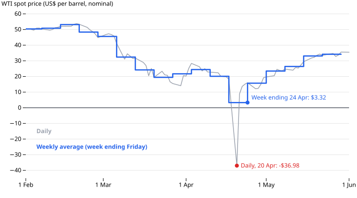

# WTI Went Negative. Brent Didn't.

*Daily spot prices, US dollars per barrel, not adjusted for inflation. Data: [oil-prices](https://github.com/datasets/datapressr/tree/main/datasets/energy-and-commodities/oil-prices), from the U.S. Energy Information Administration (EIA). Data story #3 — written from [an outline](oil-prices-outline.md).*

On 20 April 2020 the WTI spot price was **-$36.98 a barrel**. Brent, the other main crude benchmark, was **$17.36** that day. The WTI figure is the only negative value in 25,415 daily, weekly, monthly and annual Brent and WTI prices going back to 1986.

## What these numbers are

Both series are EIA's daily spot prices, "free on board": Brent for North Sea crude, WTI for crude delivered at Cushing, Oklahoma, a landlocked pipeline and storage hub. They are two different crudes at two different places, not one commodity priced twice.

They are also spot prices, not futures. The widely reported **-$37.63** is the settlement price of the May 2020 WTI futures contract on NYMEX that day, according to the [CFTC](https://www.cftc.gov/PressRoom/PressReleases/8315-20). The spot figure here, -$36.98, is related but not the same number.

## What the data says

- **WTI was negative for one day.** It fell below zero on Monday 20 April and was back above it on Tuesday.
- **Brent fell hard too.** On 21 April it was **$9.12**, two cents above its lowest daily price on record, $9.10 in December 1998. On that day WTI was back up close to it. Both benchmarks fell. Only one went below zero, and only once.
- **Averaging removes it.** EIA's weekly WTI price is the average of that week's trading days. For the week ending Friday 24 April, the average includes the -$36.98 and is still positive: **$3.32**.

So anyone using EIA's weekly, monthly or annual WTI series would not see a negative oil price at all. It only shows up in the daily figures.

## Why, according to EIA

This dataset contains prices, not reasons. It cannot show why WTI went negative, or why Brent did not. EIA's [own account](https://www.eia.gov/todayinenergy/detail.php?id=43495), published a week later, points to the May futures contract, which expired on 21 April (per the CFTC), and to storage at Cushing. The hub was 76% full on 17 April, and some of the remaining space may already have been leased or committed. Some holders of the contract, unable to take delivery, sold at negative prices — in EIA's words, "in effect paying a counterparty to allow them to exit their positions". The Cushing spot price fell below zero on 20 April, the day before the contract expired.

## How this was made

Both series come from [`oil-prices`](https://github.com/datasets/datapressr/tree/main/datasets/energy-and-commodities/oil-prices) in this repository: EIA's own spreadsheets, rebuilt into tidy CSVs by [`build.ts`](https://github.com/datasets/datapressr/blob/main/datasets/energy-and-commodities/oil-prices/build.ts). The one-negative-value count came from a statistics table produced by that dataset's `enrich.ts`. That table exists only in this repository; it is not part of any published dataset. The charts are built by [`oil-prices-make-charts.mjs`](https://github.com/datasets/datapressr/blob/main/site/stories/oil-prices-make-charts.mjs), which reads the same CSVs; re-running it reproduces them exactly. The community [`datasets/oil-prices`](https://github.com/datasets/oil-prices) package wrangles the same EIA source independently. The two are compared in the [structure benchmark](../docs/structure-benchmark.md).

All prices are in US dollars as EIA published them, not adjusted for inflation.

## Friction notes

For the `story` and `enrich` skills:

- **The consolidated table found the story.** Scanning one `min` column across all eight resources turned up the single negative cell. Without that table it would have taken a file-by-file search.
- **Outline review earned its keep.** The first outline explained *why* WTI went negative, which a price-only dataset cannot show. It also left out Brent's $9.12 the next day, and so made the contrast look stronger than the data supports. The independent reviewer caught both before any prose was written.
- **"Every number on a chart" has limits.** The dataset-wide count, Brent's 1998 low and the attributed EIA and CFTC figures cannot sit on a chart of spring 2020. The skill should say which kinds of numbers are exempt.
- **Author's voice pass: outstanding.** This prose is an AI draft rendered from the approved outline; the "sounds like me" pass has not been done.
