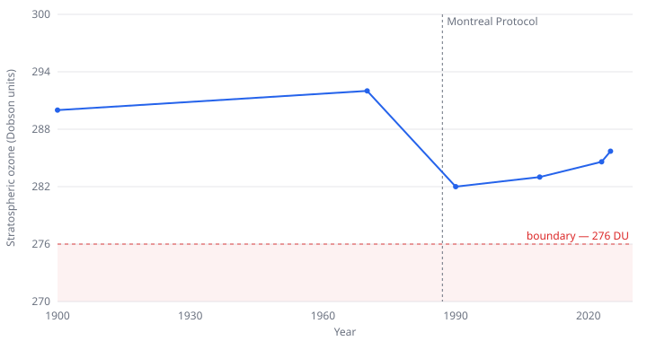

# Planetary Boundaries

*Each indicator rescaled so the pre-industrial state is 0 and the boundary is 1. Data: [planetary-boundaries](https://datahub.io/climate-and-environment/planetary-boundaries), after Steffen et al. (2015) and Richardson et al. (2023). Data story #2 — written by hand from [an outline](planetary-boundaries-outline.md).*

## Six of nine

The planetary boundaries framework tracks nine Earth-system processes that together hold the planet in the state it has kept for the last 11,700 years. Each has a boundary: a quantified limit with a safe side, and a side where the risk of large, hard-to-reverse change begins to climb. The framework was introduced in 2009 by Rockström and colleagues, given numbers in 2015 (Steffen et al., *Science*), and updated in 2023 (Richardson et al., *Science Advances*).

Six of the nine boundaries are now crossed: climate change, biogeochemical flows, freshwater change, land-system change, biosphere integrity, and novel entities. Three are not: ocean acidification, atmospheric aerosol loading, and stratospheric ozone.

## What the data says

- **Eight of the twelve sub-indicators are measurably past their boundary.** A ninth, novel entities — synthetic chemicals, plastics, and other human-made materials — sits past a boundary set at zero, and was assessed for the first time only in 2022.
- **The largest gap is in the biosphere.** Species are being lost at roughly 150 extinctions per million species-years against a boundary of 10. It is the highest reading on the board, and the one bar that runs off the chart.
- **Climate change is at 428 ppm CO₂ against a 350 ppm boundary.** It passed 350 ppm around 1988 — the same crossing marked in the [Keeling Curve](keeling-curve.md) story.
- **The crossed column has only grown.** Green-water freshwater and novel entities are recent additions to it. Nothing has moved the other way — except ozone.

## Ozone came back

Stratospheric ozone thinned through the twentieth century as chlorofluorocarbons built up in the upper atmosphere, dropping toward the boundary by about 1990. The 1987 Montreal Protocol phased the chemicals out. Ozone stopped falling and has recovered since; it is inside the safe zone today.

This is one boundary out of nine, and the cause was an unusually clean one to act on — a defined set of industrial chemicals with available substitutes. It is not a general reassurance. But it shows that a boundary is not a one-way ratchet: where the cause is identified and policy acts on it, a trend can reverse.

## How this was made

The story uses the published [`planetary-boundaries`](https://datahub.io/climate-and-environment/planetary-boundaries) dataset — the Steffen and Richardson science, plus a compilation of historical series by Bastien Gauthier. There is no wrangling here; a dated snapshot is kept in [`planetary-boundaries-src/`](planetary-boundaries-src/) so the charts stay reproducible.

The scoreboard puts twelve indicators with twelve different units — ppm, Dobson units, tonnes per year, per cent, extinctions per million species-years — on one axis. Each is rescaled so the pre-industrial value is 0 and the boundary is 1; a reading of 2 means the shift from the pre-industrial state is twice as large as the shift the boundary allows. This is the framework's own method. Novel entities has a boundary of zero, so it has no such ratio and is drawn as "beyond". The ozone chart is built from seven benchmark years in the source compilation, not an annual record.

## Friction notes

For the future `story` and charting skills:

- **The chart plan didn't survive the data.** The [outline](planetary-boundaries-outline.md) specified `current ÷ boundary` for the scoreboard. That fails on this dataset: novel entities has a boundary of zero, and the three "less is worse" indicators (ocean acidification, ozone, forest cover) plot on the wrong side of 1. The framework normalisation handles both. The lesson: a chart plan that names a formula needs the formula run against the actual columns before it is signed off.
- **A normalised ranged-bar chart by hand is about the ceiling of what inline SVG is comfortable for.** One clipped bar — genetic diversity at 16.6× — already needs special handling, and the per-indicator uncertainty ranges in the data aren't drawn at all. This is the point to bring in a library — see the [line-charts bake-off](https://github.com/datasets/line-charts).
- **What worked:** the dataset was already clean and typed, so both charts were a read-two-columns job. The effort was all in the modelling choice, not the data.
